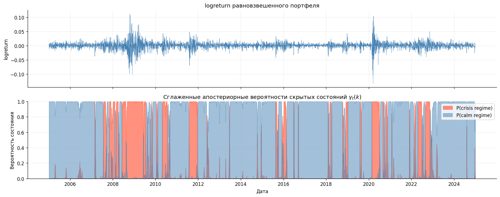
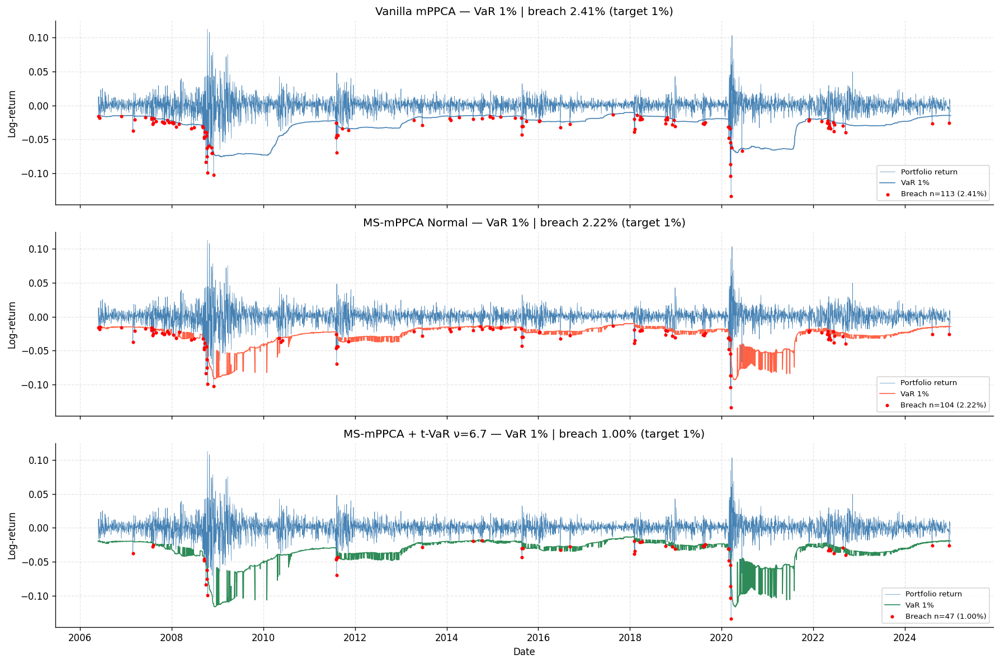
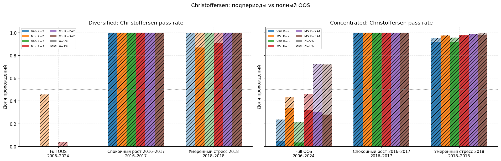

# MS-mPPCA: Markov Switching Mixture of Probabilistic PCA

Дипломная работа магистратуры МФТИ. Модель оценки Value-at-Risk на основе скрытых марковских моделей с эмиссиями из смеси вероятностных PCA.

## О проекте

Стандартные модели VaR предполагают, что рыночные режимы независимы между собой. На практике кризисы кластеризованы во времени: однажды начавшиеся убытки продолжаются неделями. Классическая смесь mPPCA игнорирует это — каждое окно обрабатывается независимо.

MS-mPPCA добавляет скрытую марковскую цепь поверх mPPCA-эмиссий. Веса смеси в каждый момент — это прогноз следующего состояния `A^T γ_T`, а не независимые апостериорные вероятности. Это даёт модели «память» о текущем рыночном режиме и позволяет лучше предсказывать кластеры нарушений VaR.

Данные: 79 акций из S&P 500, 2005–2024 (5 031 торговый день).

## Ключевые результаты

Тест Кристоффэрсена проверяет, независимы ли нарушения VaR во времени — это ключевое требование к корректной модели риска.

| Модель            | Christoffersen, α=5%, 2018 | Kupiec, α=1%, 2018 |
| ----------------- | -------------------------- | ------------------ |
| Vanilla mPPCA     | **0.5%**                   | 0%                 |
| MS-mPPCA (Normal) | **87%**                    | 0%                 |
| MS-mPPCA + t-VaR  | **100%**                   | **70%**            |

Показатели измерены на 251 торговом дне 2018 года («умеренный стресс») по 200 диверсифицированным портфелям. MS-структура в 174 раза улучшает прохождение теста независимости без каких-либо изменений в портфельных весах.

На спокойном периоде 2016–2017 все модели проходят Кристоффэрсена на 100%, что подтверждает: нулевой результат на полном OOS 2006–2024 — статистический артефакт 18-летней неоднородности, а не системная проблема модели.

### Обнаруженные рыночные режимы

HMM уверенно выделяет кризисные периоды: вероятность «кризисного» режима устойчиво превышает 0.9 в 2008–2009 и COVID-2020.



### Сравнение VaR: три модели (α=1%)

Vanilla-модель систематически занижает VaR в кризис (breach rate 2.41%). MS-mPPCA + t-VaR точно попадает в целевые 1%.



### Тест Кристоффэрсена: подпериоды vs полный OOS

На однородных 6–12-месячных окнах все MS-модели проходят тест независимости. Провал на полном OOS — следствие объединения принципиально разных волатильностных режимов в один тест.



## Архитектура модели

```
z_1 ~ Cat(π_0)
z_t | z_{t-1} ~ Cat(A_{z_{t-1}, ·})          # скрытая марковская цепь
x_t | z_t = k ~ N(μ_k, W_k W_k^T + σ²_k I)  # mPPCA-эмиссия
```

Обучение — Баум-Велч (EM). Прогноз весов смеси: `π_{t+1} = A^T γ_t`.
VaR — квантиль α смеси распределений, решается бисекцией.

Для учёта тяжёлых хвостов: параметры `(μ_k, W_k, σ²_k)` берутся из Normal-EM, квантиль считается через `t_ν`-распределение с ν, откалиброванным по частоте нарушений EW-портфеля.

## Оптимизации

Прокат по 4 681 окну (T=350, D=79, K=2, q=3) ускорен с ~20 минут до ~20 секунд:

- **Numba JIT** на forward-backward: 600× ускорение на hot-path (0.027 мс vs 16 мс)
- **Тождество Вудбери** в `emission_log_likelihoods`: операции в q-пространстве (q=3) вместо D×D матрицы (D=79)

## Этапы исследования

**1. Базовый пайплайн mPPCA** — [notebooks/basic-pipeline.ipynb](notebooks/basic-pipeline.ipynb)
Скользящее обучение Vanilla mPPCA (K=2, q=3, window=350) на 79 активах S&P 500.
Первый бэктест: тесты Купика и Кристоффэрсена на 200 диверсифицированных и концентрированных портфелях.

**2. Введение в HMM и демо MS-mPPCA** — [notebooks/hmm-demo.ipynb](notebooks/hmm-demo.ipynb)
Иллюстрация алгоритма Баума–Велча на 1D гауссовской HMM по EW-портфелю.
Демонстрация выделения кризисных режимов (2008, COVID-2020) и короткий прогон полной MS-mPPCA.

**3. MS-mPPCA против Vanilla** — [notebooks/ms-vs-vanilla.ipynb](notebooks/ms-vs-vanilla.ipynb)
Полный 18-летний бэктест: сравнение log-likelihood, динамики режимов и VaR на 200 портфелях.
Первый результат: MS улучшает Купик и Кристоффэрсен для концентрированных портфелей.

**4. Коррекция хвостов: Normal vs t-VaR** — [notebooks/student-t-comparison.ipynb](notebooks/student-t-comparison.ipynb)
Подгонка t-распределения к остаткам mPPCA; per-α калибровка ν методом бисекции по OOS-нарушениям.
Результат: t-VaR с ν≈6.7 (α=1%) выводит Купик на 100% и существенно улучшает Кристоффэрсен.

**5. K=3 режима, подпериоды и rolling ν** — [notebooks/k3-regime-comparison.ipynb](notebooks/k3-regime-comparison.ipynb)
Расширение до K=3 (третий «предкризисный» режим); анализ подпериодов 2016–2017 и 2018.
Главный вывод: K=3 не улучшает VaR-метрики относительно K=2; rolling ν с лагом 252 дня тоже не помогает.
Ключевой результат: MS K=2 + t-VaR даёт 100% Кристоффэрсен и 70% Купик в стрессовом 2018.

## Быстрый старт

```bash
pip install -r requirements.txt

python main.py                          # полный прогон
python main.py --no-download            # использовать кэш
python main.py --no-download --force-refit  # переобучить из кэша
```

Флаги: `--window` (350), `--clusters` (2), `--components` (3), `--alphas 0.05 0.01`.

Все артефакты сохраняются в `data/run/`.

## Структура

```
src/
  data/           загрузка, препроцессинг
  models/
    mppca.py      Vanilla mPPCA EM
    hmm.py        log-space forward-backward (Numba JIT), Баум-Велч
    ms_mppca.py   MS-mPPCA: EM с марковской цепью
    rolling.py    скользящее окно (warm-start)
    var.py        VaR через бисекцию + t-поправка
  backtesting/
    backtest.py   тесты Купика и Кристоффэрсена
    portfolios.py генераторы диверсифицированных/концентрированных портфелей
    pipeline.py   end-to-end пайплайн
notebooks/
  basic-pipeline.ipynb        vanilla mPPCA бэктест
  hmm-demo.ipynb              демо HMM + MS-mPPCA
  ms-vs-vanilla.ipynb         сравнение моделей
  student-t-comparison.ipynb  Normal vs t-VaR
  k3-regime-comparison.ipynb  K=3 режима, подпериоды, rolling ν
```

## Планы развития

**Цепь Маркова более высоких порядков** — переход к `P(z_t | z_{t-1}, z_{t-2}, z_{t-n+1})` через тензор (K^n) потребует forward-backward в K^n-пространстве состояний, но может улучшить захват переходной динамики кризисов с ростом.

Среди других направлений — моделирование условной волатильности поверх MS-mPPCA и hidden semi-Markov модели для режимов с явной длительностью.
